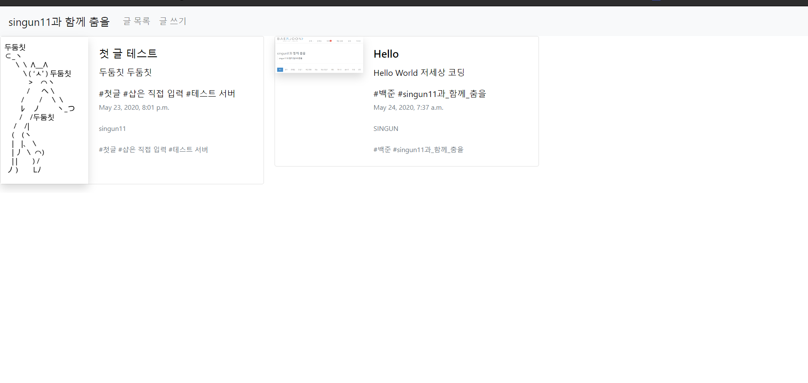
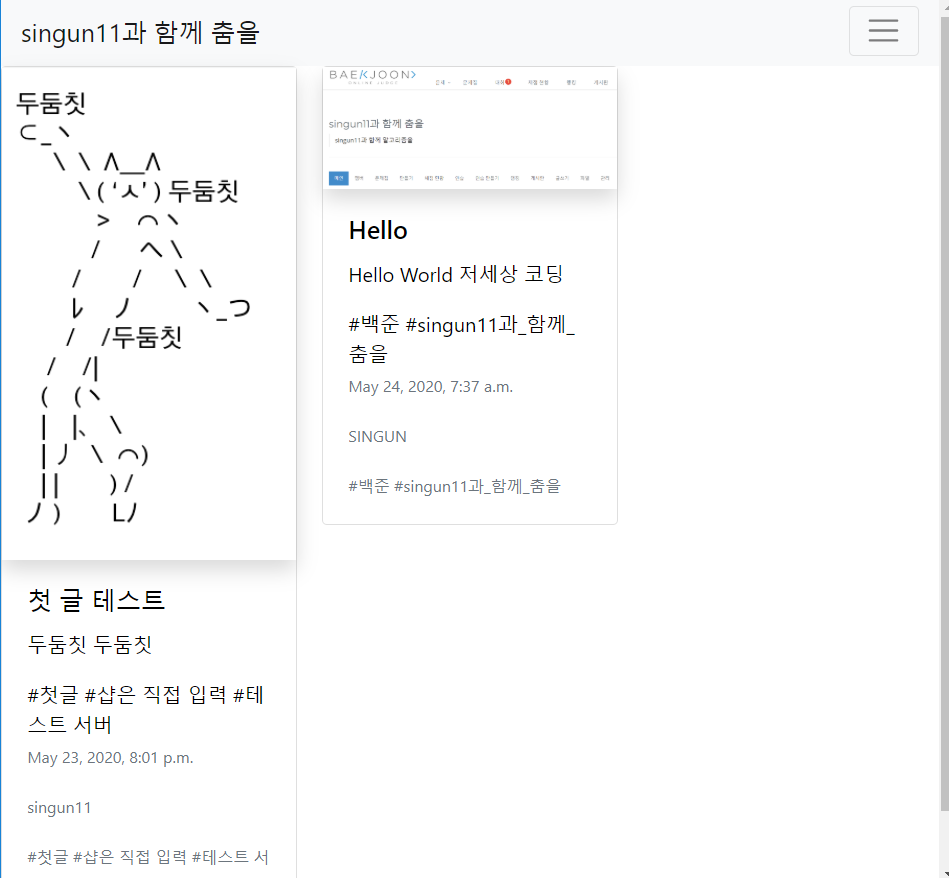
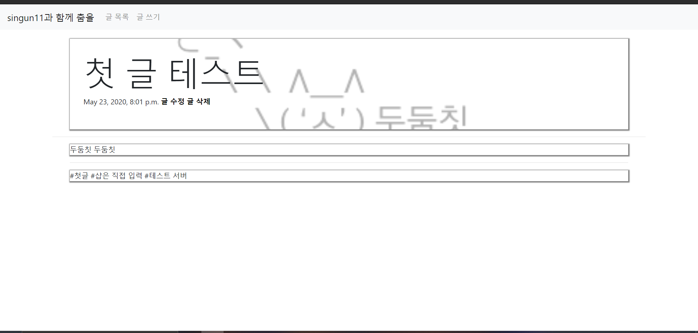
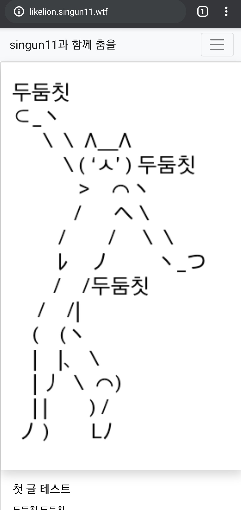
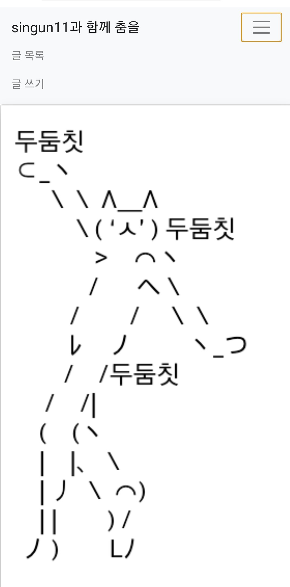
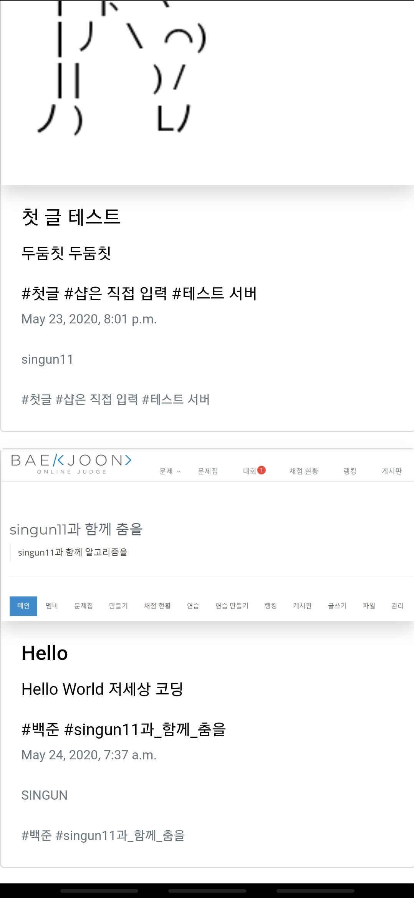

# django-blog

## description
국민대학교 멋쟁이사자에서, 진행한 django 세션 실습 과제입니다.
CRUD 관련 내용이며, 블로그 글 목록, 글 쓰기, 글 수정, 글 삭제 기능 등이 있습니다.

## usage 

1. secrets.json 파일을 아래 형식대로 만든 뒤, Blog/ 안에 넣어주세요. SECRET_KEY 부분에 django secret key generator를 사용하여 키를 만들고 넣어주면 됩니다.
```
{
    "SECRET_KEY": "b_4(!id8ro!1645n@ub55555hbu93gaia0 SECRET_KEY"
}
```
2. 패키지 설치
```
$ pip install -r requirements.txt
```

3. db 설정
Blog/ 안에 있는 db.sqlite3 파일을 삭제해주시고 Blog/ 디렉토리에서 다음 명령어를 입력해주세요.
```
$ python manage.py makemigrations
$ python manage.py migrate
```
4. start server
다음과 같이 서버를 열어주세요.
```
$ python manage.py runserver 0.0.0.0:80
```
포트 포워딩, DNS가 설정되어 있는 경우, 다음과 같이 웹사이트를 배포할 수 있습니다.

<a href = "http://likelion.singun11.wtf">likelion.singun11.wtf</a>

## Example

### Computer Screen





### Mobile Screen

<table>
    <tr>
        <td>
            
        </td>
        <td>
            
        </td>
        <td>
            
        </td>
    </tr>
</table>
